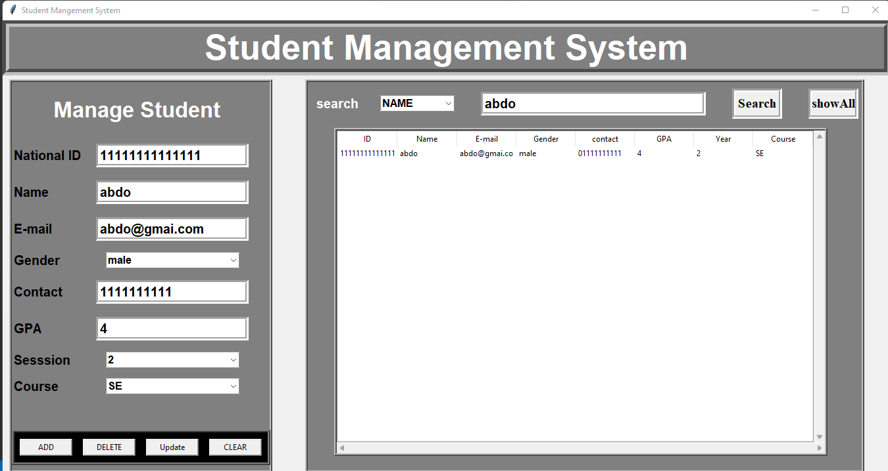

# StudentMangement System Using Tkinter

## Requirements
- python **(recommended version 3.9)**

## How To install 
1. clone repo `>> git clone [repo url]`
2. open repo with VScode 
3. open new terminal
4. run the project `>> py homePage.py`

## Simple Student Management System Panel

